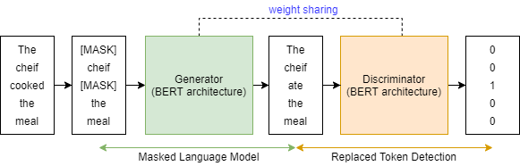
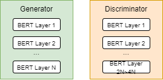
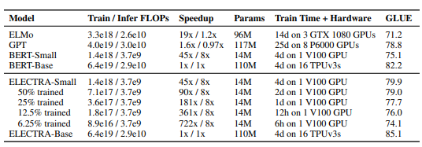

이 글에서는 ELECTRA를 공부해보려고 한다. 목차는 아래와 같다.

- Introduction
- Modeling details
- Benchmark

Introduction
----------------
ELECTRA는 Google에서 발표한 새로운 학습 방법을 이용한 Language Model이다. 이 논문에서 가장 중요한 내용은 아래와 같다.
```
훨씬 적은 수의 파라미터로 훨씬 빠르게 Language Model을 학습할 수 있다.
```
이를 가능케하는 방법을 이 글에서 설명해보려고 한다. 아래의 Modeling details에서 그 내용들을 이야기 하고 Benchmark에서 타 LM모델들과 비교를 한 후 이 글을 마치려고 한다.

Modeling details
-----------------
ELECTRA는 Efficiently Learning an Encoder that Classifies Token Replacements Accurately의 약자다. (길다...) Token Replacements를 정확하게 잘 학습하는 인코더를 효과적으로 학습한다는 뜻이다. 무슨말인가... ELECTRA의 가장 큰 핵심은 Replaced Token Detection인데, 이것에 대해서 알아보도록 하자.

### Masked Language Model and Replaced Token Detection (MLM and RTD)
기존의 BERT에서는 MLM을 이용해서 LM의 성능을 비약적으로 발전시켰다. MLM을 이용한 BERT는 한번 학습하는데 굉장히 많은 HW 리소스와 시간을 소모한다. ELECTRA를 학습할 때 GAN과 같이 Generator와 Discriminator로 나눈다. ELECTRA의 Generator는 BERT의 MLM과 같은 방법으로 학습을 한다. Discriminator를 학습할 때 RTD를 이용한다.

길게 설명할 필요 없이 아래의 예제로 모두 설명할 수 있다. 학습할 때 데이터가 변하는 과정을 설명한 예제이다.
```
inputs = ['the', 'chef', 'cooked', 'the', 'meal']
masked = ['[MASK]', 'chef', '[MASK]', 'the', 'meal']
generated = ['the', 'chef', 'ate', 'the', 'meal']
is_replaced = [0, 0, 1, 0, 0]
```
`inputs`에서 랜덤으로 토큰 몇 개를 선택해서 `masked`를 만든다. `masked`를 이용해서 MLM을 학습하는 것이 ELECTRA의 Generator이다. 그렇게 해서 Generator가 만들어낸 문장이 `generated`인데, 이 문장을 원래의 `inputs`과 비교해서 바뀌었는지(1) 그렇지 않은지(0)을 판단해서 `is_replaced`를 만든다. 즉 원래의 데이터에서 데이터가 바뀌었는지를 토큰마다 판단하게 된다. 각 토큰마다 바뀌었는지를 확인하게 된다는 것은 모든 토큰이 학습에 사용된다는 뜻이다.

ELECTRA의 Discriminator가 모든 토큰을 사용해서 학습을 하게 되는데, 이로 인해서 BERT에 비해 학습속도가 확 줄어들게 된다는 것이 이 논문의 핵심이다. 

BERT에서는 MLM 이후에는 Next Sentence Prediction(NSP)를 했다. NSP에서 모든 토큰이 학습에 직접 사용되지는 않는다. NSP의 입력으로 MLM의 결과값이 들어가지만 직접적으로 하나하나의 토큰을 이용해서 학습을 하는 것은 아니기 때문이다. 즉, BERT에서는 MLM에서 랜덤으로 선택된 15% 만이 학습에 직접적으로 사용된다는 뜻이다.
```
BERT는 MLM → NSP (전체 Token의 15% 만이 학습에 직접적으로 사용됨)
ELECTRA는 MLM → RTD (전체 Token이 모두 학습에 직접적으로 사용됨)
```

논문에서 이 개념을 그림 하나로 잘 설명하고 있다.
그림1

Training details
--------------------
학습시 알아봐야 할 몇가지 디테일이 있다.
- Weight sharing
- Smaller generator

### Weight sharing
말 그대로 학습된 Weight을 share하는 것이다. Generator와 Discriminator가 서로서로 Weight을 공유한다. Generator를 하나의 BERT 구조로 보고 Discriminator를 또 다른 BERT 구조로 봤을 때 둘이는 서로 같은 구조이기 때문에 Weight을 공유할 수 있다. 



그런데 여러번의 실험의 결과 Generator를 Discriminator보다 좀 작은 모델로 만드는 것이 좀 더 성능이 좋게 나왔다고 한다. 이럴 경우 Generator와 Discriminator의 파라미터 개수가 다르기 때문에 완전한 Weight sharing을 할 수 없다. 따라서 부분적으로 할 수 있는 부분만 찾아서 Weight sharing을 하는데, 그 부분이 token embedding과 positional embedding이다. 
```
"...However, we found it to be more efficient to have a small generator, in which case we only share the embeddings (both the token and positional embeddings) of the generator and discriminator...."
```

### Smaller Generator
위에서 언급한데로 ELECTRA에서 Discriminator보다 Generator의 크기를 더 작게 해서 사용한다. 실험 결과 Generator의 사이즈가 Discriminator 사이즈의 1/4에서 1/2 정도 됐을 때 성능이 가장 좋았다고 한다. 이 때, Generator 크기를 작게 하기 위해 레이어 사이즈를 줄이고 다른 파라미터는 같게 뒀다고 한다. 




Benchmark
-------------------
논문에서 많은 Benchmark 비교를 해놨지만, 가장 중요하다고 생각하는 하나만 이야기해보려고 한다.



`ELECTRA-Small`의 `6.25% trained`를 보면 GLUE 스코어가 74.1인데 이 모델은 V100 GPU로 6시간 학습한 것이다. 이 스코어는 같은 파라미터 사이즈인 `BERT-Small`로 같은 GPU를 썼을 때 4일동안 학습한 것과 거의 비슷한 결과가 나온다. 이 모델의 사이즈를 키워서 오랫동안 학습하면 당연히 위 비교군 중에서는 최고의 성능을 보이게 된다.

개인적인 생각으로 작은 모델로 6시간 학습한 것이 74.1이 나온 것은 굉장히 학습시간의 가성비가 좋다고 느껴지나 `ELECTRA-Base`를 4일간 학습해서 85.1이 나온 것은 `BERT-Base` 스코어인 82.2보다는 좀 가성비가 덜 나온다고 생각된다. 그래도 물론 엄청난 차이다. 무려 3%차이.

핵심은 하나다. ELECTRA를 통해서 학습의 효율을 극대화 시킬 수 있다는 것이다. 그래서 ELECTRA의 E가 `Efficiently`이다.
